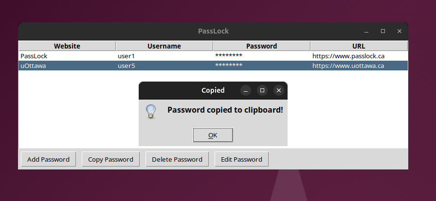

<<<<<<< HEAD
# pass-lock
=======
# PassLock - A Secure Password Manager

**PassLock** is a secure, easy-to-use password manager that helps you store and manage your passwords. It uses **AES encryption** for storing passwords securely and **TOTP (Two-Factor Authentication)** for enhanced security. This application features an intuitive graphical interface built with **Tkinter**.



## Features

- **Master Password Protection**: Encrypts your passwords with a secure master password.
- **Two-Factor Authentication (TOTP)**: Integrates Google/microsoft/Duo Authenticator app for an extra layer of security.
- **Encrypted Password Storage**: All passwords are encrypted using **Fernet encryption**.
- **Password Management**: Adds, updates, deletes, and copies passwords.
- **Clipboard Support**: Copies usernames and passwords directly to the clipboard.
- **SQLite Database**: Stores your passwords in a local database for easy management.

## Requirements

Before running this application, ensure you have the following installed:

- **Python 3.x** (tested on Python 3.8+)
- **Pip** for installing dependencies

### Dependencies

Install the required libraries with:

```bash
pip install tkinter cryptography pyperclip pyotp qrcode sqlite3


### Create a Virtual Environment (venv)

To isolate the project\'s dependencies, create a virtual environment by running the following command:

python3 -m venv venv
Activate the virtual environment:
source venv/bin/activate
pip install cryptography pyperclip pyotp qrcode

You can also use "pdm install" if you used pdm init your project structure

### Generate and export a new Fernet key
key = Fernet.generate_key()
print(key.decode())  # Decode to string for easier handling
Set the FERNET_KEY as an Environment Variable:

On macOS/Linux:
export FERNET_KEY="your_generated_key_here"
On Windows (PowerShell):
$env:FERNET_KEY="your_generated_key_here"
Replace "your_generated_key_here" with the actual key you generated in step 1.

### Running the application
Now that everything is set up, run the application using the command:
python3 src/pass-lock.py


>>>>>>> 47107da (Initial commit with .gitignore and project files)
